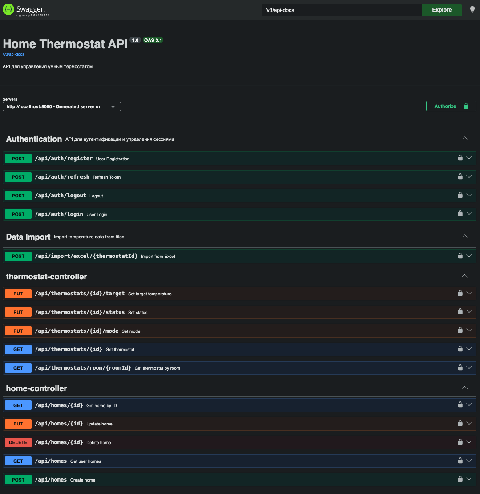
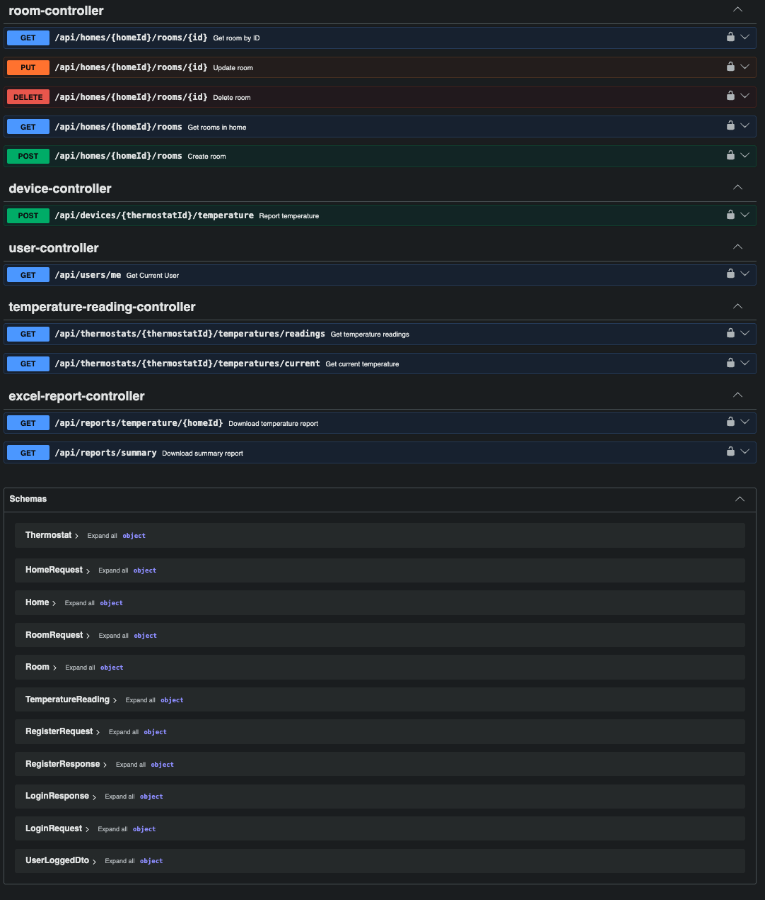
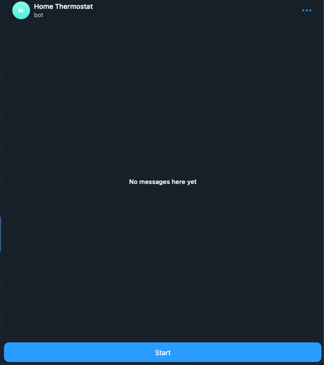
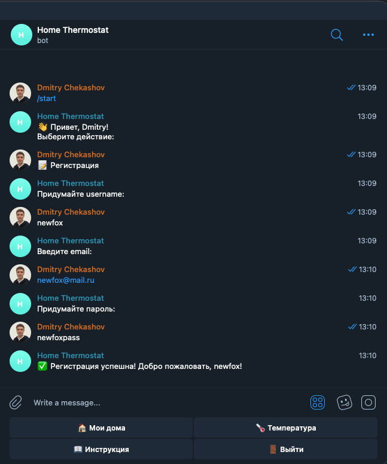
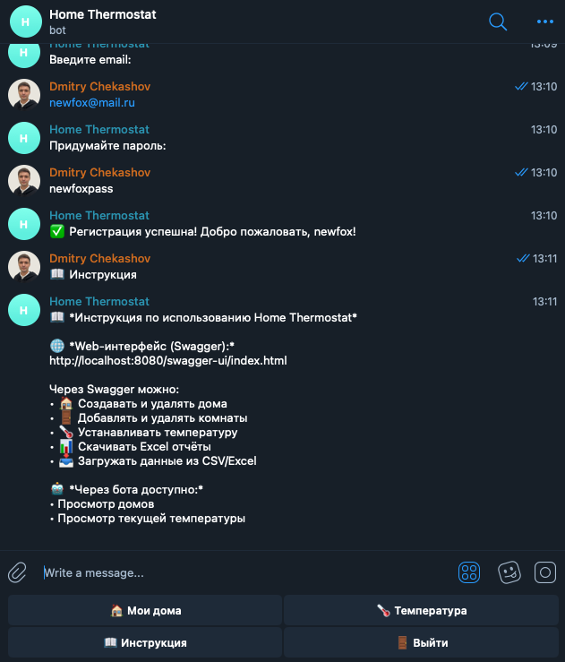
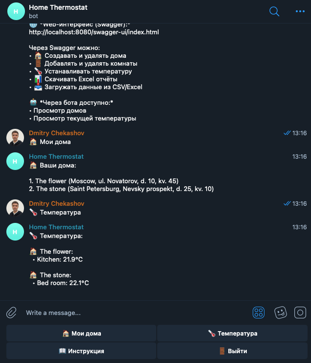
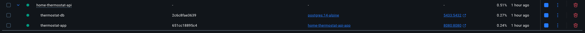

# home-thermostat-api

Home Thermostat API — REST API для системы умного термостата, которое позволяет управлять домами, комнатами, термостатами и отслеживать температуру.

## 📋 Tech Stack

- Java 21
- Spring Boot 4.0.0
- Spring Security + JWT
- PostgreSQL
- Apache POI (Excel reports)
- Telegram Bot API
- Swagger/OpenAPI
- Docker + Docker Compose

## 🚀 Quick Start

```bash
# 1. Clone
git clone https://github.com/DimaChekashov/home-thermostat-api.git
cd home-thermostat-api

# 2. Configure
cp src/main/resources/secret.properties.example src/main/resources/secret.properties
# Edit with your values

# 3. Start database
docker compose up -d postgres

# 4. Run
mvn spring-boot:run
```

- Swagger: http://localhost:8080/swagger-ui/index.html
- Telegram Bot: https://t.me/home_thermostat_bot

## 💻 Local Development

```bash
# Start database only
docker compose up -d postgres

# Run with Maven
mvn spring-boot:run

# Or run JAR
mvn clean package -DskipTests
java -jar target/home-thermostat-api-0.0.1-SNAPSHOT.jar
```

## 🚢 Production Deploy

```bash
# 1. Clone and configure
git clone https://github.com/DimaChekashov/home-thermostat-api.git
cd home-thermostat-api
cp .env.example .env
nano .env

# 2. Build and start
docker compose up -d --build

# 3. Verify
curl http://localhost:8080/swagger-ui/index.html
docker compose logs -f app
```

## 🐳 Docker Reference

| Command | Description |
|:---|:---|
| docker compose up -d postgres | Start database |
| docker compose up -d --build | Build and start all |
| docker compose down | Stop all |
| docker compose logs app | View app logs |
| docker compose restart | Restart services |
| docker exec -it thermostat-db psql -U postgres -d rest_api | Connect to DB |

## 📥 Import Format

### Excel Template (.xlsx)

| value | timestamp | source |
|:---|:---|:---|
| 23.5 | 2026-04-26 10:00:00 | SENSOR |
| 23.3 | 2026-04-26 10:30:00 | SENSOR |
| 23.7 | 2026-04-26 11:00:00 | SENSOR |
| 24.0 | 2026-04-26 11:30:00 | SIMULATOR |
| 23.8 | 2026-04-26 12:00:00 | MANUAL |

- value — temperature in °C
- timestamp — format: yyyy-MM-dd HH:mm:ss
- source — SENSOR, SIMULATOR, MANUAL, IMPORTED

## 📡 API Endpoints

### Authentication

- POST - `/api/auth/register` Register a new user
- POST - `/api/auth/login` Login with username and password
- POST - `/api/auth/refresh` Refresh access token using refresh token
- POST - `/api/auth/logout` Logout and revoke tokens

### User

- GET - `/api/users/me` Get currently authenticated user info

### Home

- GET - `/api/homes` Get all homes of current user
- GET - `/api/homes/{id}` Get home by ID
- POST - `/api/homes` Create a new home
- PUT - `/api/homes/{id}` Update existing home
- DELETE - `/api/homes/{id}` Delete home

### Room

- GET - `/api/homes/{homeId}/rooms` Get all rooms in a home
- GET - `/api/homes/{homeId}/rooms/{id}` Get room by ID
- POST - `/api/homes/{homeId}/rooms` Create a new room in a home
- PUT - `/api/homes/{homeId}/rooms/{id}` Update room
- DELETE - `/api/homes/{homeId}/rooms/{id}` Delete room

### Thermostat

- GET - `/api/thermostats/{id}` Get thermostat by ID
- GET - `/api/thermostats/room/{roomId}` Get thermostat by room ID
- PUT - `/api/thermostats/{id}/target?value={temp}` Set target temperature
- PUT - `/api/thermostats/{id}/mode?mode={mode}` Set thermostat mode (HEAT/COOL/OFF)
- PUT - `/api/thermostats/{id}/status?status={status}` Set thermostat status (ACTIVE, INACTIVE)

### TemperatureReading

- GET - `/api/thermostats/{thermostatId}/temperatures/readings?minutes={n}` Get temperature readings for period
- GET - `/api/thermostats/{thermostatId}/temperatures/current` Get current temperature

### Device Integration (for IoT sensors)

- POST - `/api/devices/{thermostatId}/temperature?value={temp}` Report temperature from sensor

### Reports (Excel)

- GET - `/api/reports/summary` Download summary Excel report for all homes
- GET - `/api/reports/temperature/{homeId}?days={n}` Download temperature Excel report for a home

### Data Import

- POST - `/api/import/excel/{thermostatId}` Upload Excel file with temperature data

## 📸 Screenshots

### Swagger




### Telegram Bot

#### Main Screen



#### Start


#### Registration



#### Instructions



#### Show temperature



### Docker



## 📝 Project Report

### What was implemented

- REST API for smart thermostat system
- JWT authentication with HttpOnly cookies
- CRUD for homes, rooms, thermostats
- Temperature monitoring with simulator
- Excel reports (download + import)
- Telegram bot with keyboard navigation
- Docker containerization
- Role-based access control (RBAC)

### Technologies used

- Backend: Java 21, Spring Boot 4.0.0
- Security: Spring Security, JWT
- Database: PostgreSQL, Spring Data JPA
- Reports: Apache POI
- Bot: Telegram Bot Java Library
- Containerization: Docker, Docker Compose
- Docs: Swagger/OpenAPI 3.1

### Resources

- [Spring Boot Documentation](https://docs.spring.io/spring-boot/documentation.html)
- [Spring Security Reference](https://docs.spring.io/spring-security/reference/index.html)
- [JWT.io](JWT.io)
- [Telegram Bot API Documentation](https://core.telegram.org/bots/api)
- [TelegramBots Documentation](https://rubenlagus.github.io/TelegramBotsDocumentation/telegram-bots.html)
- [Apache POI Documentation](https://poi.apache.org/apidocs/5.0/)
- [Docker Documentation](https://docs.docker.com/)